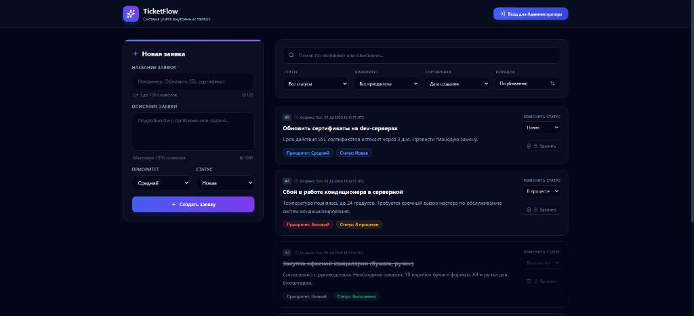
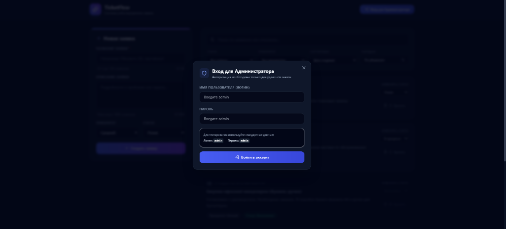
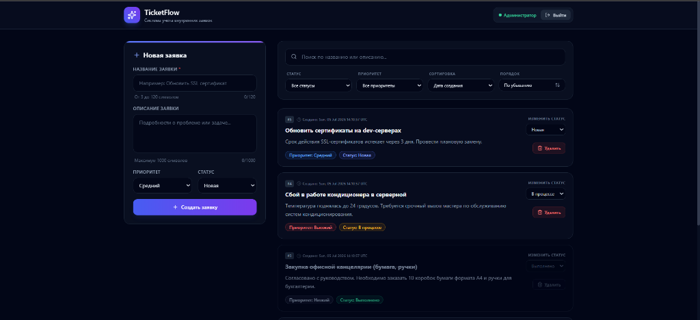

# TicketFlow — Internal Request & Ticket Management System

[](https://python.org)
[](https://fastapi.tiangolo.com)
[](https://react.dev)
[](https://typescriptlang.org)
[](https://tailwindcss.com)
[](https://sqlite.org)
[](LICENSE)

TicketFlow is a lightweight, responsive, and modern full-stack web application designed for tracking and managing internal company requests, support tickets, and general tasks. It combines a fast Python/FastAPI backend with a clean React/TypeScript SPA frontend powered by TailwindCSS.

---

## 📸 Screenshots

### Guest Dashboard View


### Administrator Authentication


### Admin Action Controls



---

## ✨ Features

- **Server-Side Operations:** High-performance search, multi-column sorting (creation date, priority), status/priority filtering, and pagination handled directly by the SQLAlchemy query builder.
- **Role-Based Guards (RBAC):** Guest users can view, filter, sort, search, create, and update active tickets. Only authenticated Administrators can perform delete actions.
- **Strict Business Logic Guards:**
  - Completed (`done`) tickets are locked for modification, status updates, or deletion.
  - Completed status is terminal: once a ticket is marked as completed, it cannot be reverted to any active state.
- **Fluid UI:** Interactive toast notifications, smooth modal transitions, dynamic status badges, and custom pagination selectors.

---

## 🛠 Tech Stack

### Backend
- **Python 3.12**
- **FastAPI** — High-performance asynchronous API framework.
- **SQLAlchemy** — Object-Relational Mapping (ORM) library.
- **SQLite** — Embedded relational database storage.
- **Uvicorn** — Lightning-fast ASGI server.

### Frontend
- **React 19** (Single Page Application)
- **TypeScript**
- **Vite** — Next-generation frontend build tooling.
- **TailwindCSS** — Utility-first styling framework.
- **Lucide Icons** — Clean SVG icon set.

---

## 📁 Project Structure

```text
test_tz/
├── backend/                   # FastAPI Backend
│   ├── app/                   # Application Core
│   │   ├── database.py        # SQLite Engine & SQLAlchemy Session
│   │   ├── models.py          # SQLAlchemy Models (Ticket schema)
│   │   ├── schemas.py         # Pydantic Schemas / DTO Validation
│   │   ├── crud.py            # DB operations (Search, Filter, Pagination, Sort)
│   │   └── main.py            # API Route Controllers & Business Rules
│   ├── requirements.txt       # Python Dependencies
│   └── tickets.sqlite         # SQLite DB File (auto-generated on launch)
│
├── frontend/                  # React Frontend SPA
│   ├── src/
│   │   ├── App.tsx            # Main Application Dashboard
│   │   ├── index.css          # Tailwind CSS Directives
│   │   └── main.tsx           # React entrypoint
│   ├── index.html             # HTML layout & SEO tags
│   ├── tailwind.config.js     # Tailwind CSS Configuration
│   └── package.json           # npm Dependencies & Scripts
│
├── docs/
│   └── images/                # Embedded UI screenshots
├── .gitignore                 # Git ignore patterns
└── README.md                  # Project documentation
```

---

## 🚀 Installation & Local Setup

### Prerequisite Checklist
- **Python 3.12+**
- **Node.js 20+**
- **npm 10+**

### 1. Backend Server Setup

Navigate into the `backend` directory:
```bash
cd backend
```

Create and activate a virtual environment:
- **Windows (PowerShell):**
  ```powershell
  python -m venv venv
  .\venv\Scripts\activate
  ```
- **macOS / Linux:**
  ```bash
  python3 -m venv venv
  source venv/bin/activate
  ```

Install the dependencies:
```bash
pip install -r requirements.txt
```

Launch the development server:
```bash
uvicorn app.main:app --reload --port 8000
```
- **API URL:** `http://localhost:8000`
- **Swagger Documentation:** `http://localhost:8000/docs`

---

### 2. Frontend Application Setup

Open a new terminal window and navigate to the `frontend` directory:
```bash
cd frontend
```

Install npm dependencies:
```bash
npm install
```

Start the Vite development server:
```bash
npm run dev -- --port 5173
```
- **Vite Server URL:** `http://localhost:5173`

---

## 🔑 Administrative Access

To remove tickets, authenticate using the **"Вход для Администратора"** button in the header:
- **Username:** `admin`
- **Password:** `admin`

---

## 🔗 API Endpoint Reference

| Method | Endpoint | Access Level | Description |
| :--- | :--- | :--- | :--- |
| **POST** | `/api/login` | Public | Authenticates credentials and returns a session token. |
| **GET** | `/api/tickets` | Public | Retrieves a paginated list of tickets. Supports `status`, `priority`, `search`, and sorting parameters. |
| **POST** | `/api/tickets` | Public | Creates a new ticket (expects title, description, priority, status). |
| **GET** | `/api/tickets/{id}` | Public | Retrieves specific ticket details. |
| **PATCH** | `/api/tickets/{id}` | Public | Updates ticket information or changes status. |
| **DELETE** | `/api/tickets/{id}` | Admin Only | Deletes a ticket (requires `Authorization: Bearer <admin-token>` header). |

---

## 📝 License

Distributed under the MIT License. See `LICENSE` for more details.
